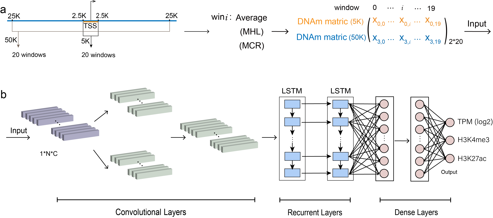
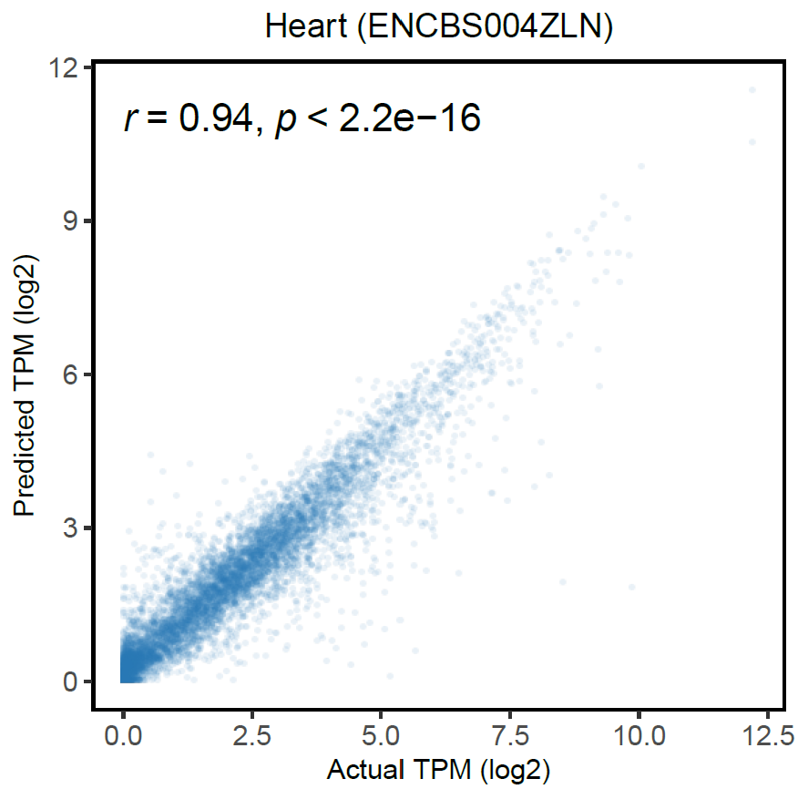

# TRAmHap


TRAmHap is a novel deep-learning framework, which predicts transcriptional activity using characteristics of DNA methylation haplotypes in proximal promoters and enhancers as far as 25 kb away from TSS.

## Prerequisites

Python 3.8.8 or greater with the following packages:

1. [pytorch](https://pytorch.org/) v1.9.1+cu102
2. [numpy](https://numpy.org/) v1.21.5
3. [pandas](https://pandas.pydata.org/) v1.3.5
4. [matplotlib](https://matplotlib.org/) v3.5.1

## Workflow




## Data preprocessing

#### Datasets

To demonstrate the usage of TRAmHap, we have provided a mouse heart dataset, which can be downloaded from [Test DataSets](https://github.com/SQ-Gao/TRAmHap/tree/main/TestDatasets).
It contains the following heart tissue samples:

| Tissue | Name        | Description                              | GEO Accession |
| ------ | ----------- | ---------------------------------------- | ------------- |
| heart  | ENCBS366XOW | Heart from 69 embryonic 10.5 day mice    | GSM2701082    |
| heart  | ENCBS490ZWZ | Heart from embryonic 13.5 day mice       | GSM2191246    |
| heart  | ENCBS004ZLN | Heart, Mus musculus                      | GSM2191412    |
| heart  | ENCBS909LOF | Heart from 62 embryonic 15.5 day mice    | GSM2191436    |
| heart  | ENCBS955JPC | Heart pooled from embyonic 16.5 day mice | GSM2191004    |
| heart  | ENCBS557AAA | Heart from pooled postnatal 0 day mice   | GSM2191652    |
| heart  | ENCBS225RIF | Heart from 109 embyronic 11.5 day mice   | GSM2192039    |


#### Window definition file

Since TRAmHap uses window-based summary statistics for prediction, these intervals should be provided in advance. Specifically, two BED files are needed, one for 5 kb region,  and another one for 50 kb region. The BED files have the following columns: 

| Column   | Description                                       |
| -------- | ------------------------------------------------- |
| Chr      | chromosome name                                   |
| Start    | start position                                    |
| End      | end position                                      |
| gene_win | region name, in the format of geneID_windowNumber |


#### DNA methylation metrics
We used the DNA methylation metrics in TRAmHap, i.e., average methylation, MCR, and MHL. Average and MCR were calculated using [mHapTools](https://jiantaoshi.github.io/mHap/index.html), and MHL was calculated with an in-house script. Recently, we have developed a new software package [mHapTk](https://jiantaoshi.github.io/mhaptk/index.html), which can be used to calculate these three DNA methylation metrics as well as several others.

Finally, all data were loaded into numpy matrix in Python and saved as a `.npy` file. The matrix has the following columns:

| Column | Description                                      |
| ------ | ------------------------------------------------ |
| gene   | geneID                                           |
| mM5    | mean methylation for 5 kb regions                |
| MHL5   | MHL for 5 kb regions                             |
| MCR5   | MCR for 5 kb regions                             |
| mM50   | mean methylation for 50 kb regions               |
| MHL50  | MHL for 50 kb regions                            |
| MCR50  | MCR for 50 kb regions                            |

#### Response variables

RNAseq and ChIP-seq data were processed using existing pipelines. Gene expression and enrichment scores of histone modifications were loaded into numpy and saved as a `.npy` file.

| Column    | Description                                                  |
| --------- | ------------------------------------------------------------ |
| gene      | GeneID                                                       |
| H3K27ac   | Histone modification enrichment (upstream 1000bp to downstream 200bp of TSS) |
| H3K4me3   | Histone modification enrichment (upstream 1000bp to downstream 200bp of TSS) |
| TPM(log2) | Gene expression, log2(TPM+1)                                 |

### Inputs

TRAmhap has two types of inputs, `training input` & `predicting input`.


#### Training Input

For model training, all the training data should be preprocessed as `.npy` files. The training command has the following options:

        -S : (str) Choose a sample as the valid dataset.
        -I : (str) Data folder with processed data.
        -O : (str) Output folder for saving results.
        -M : (str) Model folder for saving model parameters.
        -E : (int) Number of epochs for training (default=90).
        -K : (str) Regions to be used. [5, 50, all]
        -T : (str) Statistics to be used. [0,1,2] represent mean methylation, MHL, and MCR, respectively.


#### Predicting input

For making predictions, the data should be preprocessed as .npy files. The prediction command has the following options:

        -I : (str) Data path to be predicted.
        -O : (str) Output Folder for saving result.
        -M : (str) Model parameters to be used.
        -K : (str) Regions to be used. [5, 50, all]
        -T : (str) Statistics to be used. [0,1,2] represent mean methylation, MHL, and MCR, respectively.


## Example of usage

We use ENCBS004ZLN sample as the test data set of the model, and we pooled all other heart samples, which are then split into training and validating sets with the ratio of 8:2.

#### Run prediction

```shell
#Training
python3 ~/TRAmHap/RunModel/run_TRAmHap_Train.py -S ENCBS004ZLN \
-I ~/TRAmHap/TestDatasets/trainning/demo_traindata \
-O file_fig \
-M ~/TRAmHap/TestDatasets/trainning/demo_model \
-T 0

#Predicting
python3 ~/TRAmHap/RunModel/run_TRAmHap_Predict.py \
-I ~/TRAmHap/TestDatasets/demo_testdata/data/x_ENCBS004ZLN.npy \
-O ~/TRAmHap/TestDatasets/demo_testdata/test_file_fig \
-M ~/TRAmHap/TestDatasets/trainning/demo_model/model_ENCBS004ZLN.pkl \
-T 0
```

The predicting output file is .csv file with 4 columns, including `index`,`P_H3K27ac`, `P_H3K4me3`, `P_log2(TPM+1)`.



(The above scatterplot is from R-ggplot)
