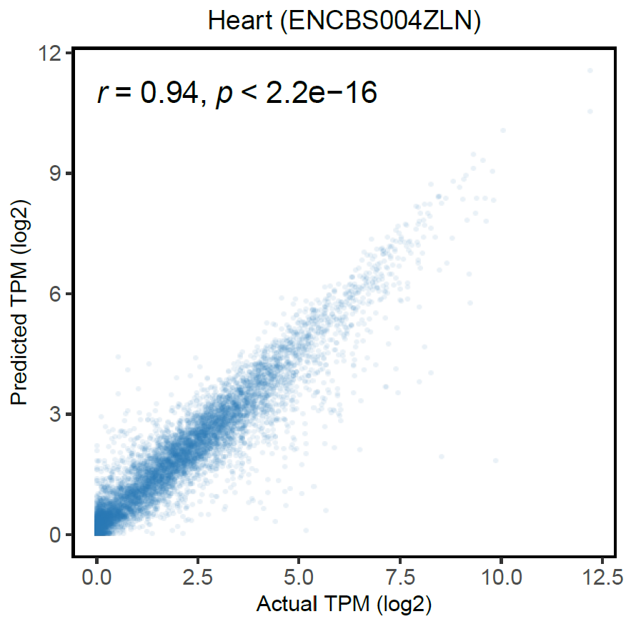

# TRAmHap

A novel deep-learning framework, termed **TRAmaHap**, that predict transcriptional activity using characteristics of DNA methylation haplotypes in proximal promoters and enhancers as far as 25 kb away from TSS.

### Prerequisites

Python 3.8.8 or greater:

1. [pytorch](https://pytorch.org/) v1.9.1+cu102
2. [numpy](https://numpy.org/) v1.21.5
3. [pandas](https://pandas.pydata.org/) v 1.3.5
4. [matplotlib](https://matplotlib.org/) v3.5.1


### Workflow


### Inputs
TRAmhap has two types of input, `trainning input` & `prediting input`.

####    Trainning Input

For model trainning, all the trainning data should be preprocessed as .npy files.
As all the data prepared, one can use COMMAND to train the model. 

    The configs for the command are shown as below:
        -S : Choose a sample as valid dataset.
        -I : Data Folder with processed data.
        -O : Output Folder for saving result.
        -M : Model Folder for saving model parameters.
        -E : Number of epoch for trainning (default=90).
        -K : Window size of inpur gene (default="all").
        -T : Statistics to be used (default="all").

####    Predicting Input

For making predictions, the data should be preprocessed as .npy files.
As the predicting data prepared, one can use COMMAND to make prediction. 

    The configs for the command are shown as below:
        -I : Data path to be predict..
        -O : Output Folder for saving result.
        -M : Model parameters to be used.
        -K : Window size of inpur gene (default="all").
        -T : Statistics to be used (default="all").


### Example of usage:

#### Datasets

To demenstrate the usage of TRAmHap, we have provided a mouse heart datasets, which can be downloaded from 

[TestDataSets](https://github.com/SQ-Gao/TRAmHap/tree/main/TestDatasets).

| Tissue | Name        | Description                              | GEO Accession |
| ------ | ----------- | ---------------------------------------- | ------------- |
| heart  | ENCBS366XOW | Heart from 69 embryonic 10.5 day mice    | GSM2701082    |
| heart  | ENCBS490ZWZ | Heart from embryonic 13.5 day mice       | GSM2191246    |
| heart  | ENCBS004ZLN | Heart, Mus musculus                      | GSM2191412    |
| heart  | ENCBS909LOF | Heart from 62 embryonic 15.5 day mice    | GSM2191436    |
| heart  | ENCBS955JPC | Heart pooled from embyonic 16.5 day mice | GSM2191004    |
| heart  | ENCBS557AAA | Heart from pooled postnatal 0 day mice   | GSM2191652    |
| heart  | ENCBS225RIF | Heart from 109 embyronic 11.5 day mice   | GSM2192039    |

#### Run prediction

```shell
#Trainning
python3 ~/TRAmHap/RunModel/run_TRAmHap_Train.py -S ENCBS004ZLN \
-I ~/TRAmHap/TestDatasets/trainning/demo_data \
-O ~/TRAmHap/TestDatasets/trainning/file_fig \
-M ~/TRAmHap/demo_model -T 0

#Predicting
python3 ~/TRAmHap/RunModel/run_TRAmHap_Predict.py \
-I ~/TRAmHap/TestDatasets/demo_testdata/x_ENCBS004ZLN.npy \
-O ~/TRAmHap/demo_file_fig \
-M ~/TRAmHap/demo_model/model_ENCBS004ZLN.pkl -T 0
```

The predicting output file is .csv file with 4 columns, including `index`,`P_H3K27ac`, `P_H3K4me3`, `P_log2(TPM+1)`.



(The above scatterplot is from ggplot)